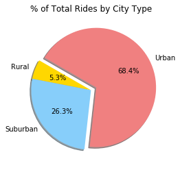

# Pyber Assignment

## HW_05_MatPlotLib

#### Analysis

+ It can be inferred that the Urban areas are more compressed and the Rural areas are a lot more spaced out than the urban areas.  This is visible in the disparity in cost of ride and the amount of drivers between Urban and Rural areas.  This can be clearly seen in the chart below.

###### The next two pieces of the analysis can be seen in the trio of charts at the bottom.

+ Overall, rural areas had the least usage of the Pyber ridesharing service.  This trend is visible given the low percentage of rides, drivers, and total fares.  

+ Urban areas, by far have the highest usage of the Pyber ridesharing service and easiest availability of the service as well.  This trend is visible given the high percentage of rides, drivers, and total fares presented below.

